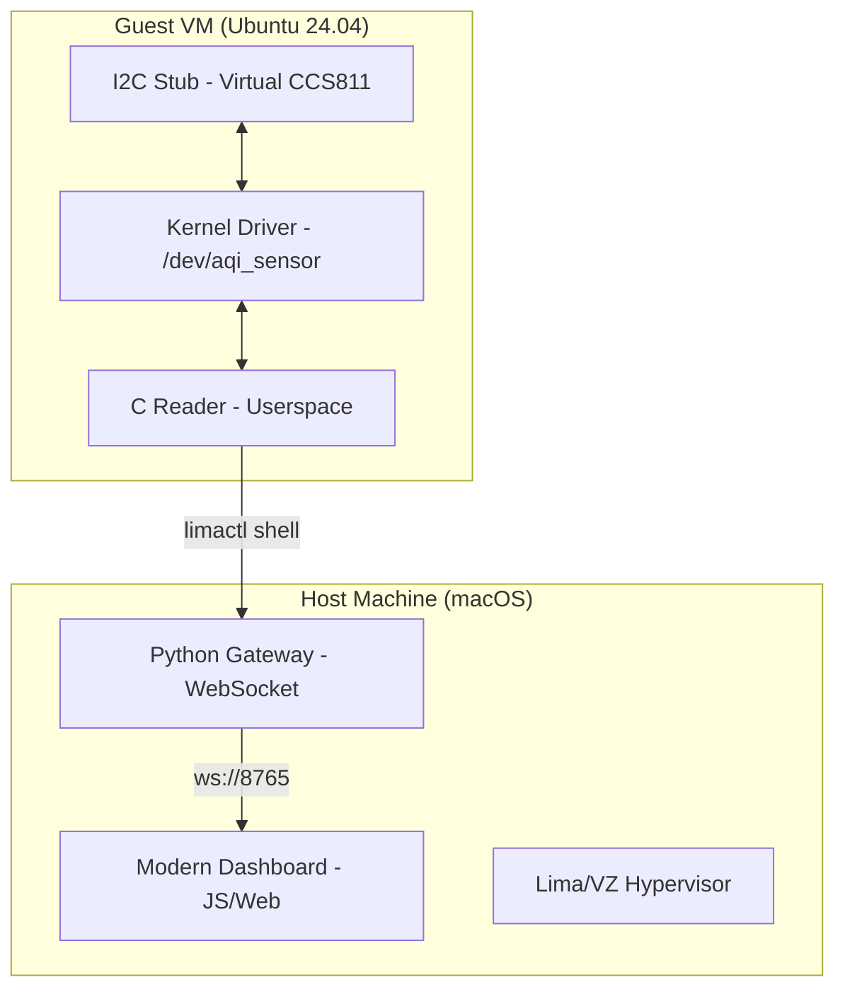

# System Architecture: Linux AQI Driver

This document details the internal design and data flow of the Linux Air Quality (AQI) monitoring stack.

---

## 🏗 High-Level Architecture
The system follows a tiered architecture to bridge low-level hardware interrupts with high-level web visualization across a virtualized boundary.

---

## 1. Kernel Layer (`kernel/aqi_sensor.c`)
The driver is a **Linux Character Device** that interfaces with the I2C subsystem.

### Components
- **I2C Driver**: Registers an `i2c_driver` structure to bind to `ccs811` devices.
- **Character Device**: Allocates a major/minor number and creates `/dev/aqi_sensor`.
- **Data Path**:
    1.  `aqi_read()` is called from userspace.
    2.  The driver executes `i2c_smbus_read_byte_data()` to fetch 4 bytes from register `0x02`.
    3.  Data is packaged into a `struct aqi_reading` and sent to userspace via `copy_to_user()`.

---

## 2. Userspace Bridge (`userspace/aqi_reader.c`)
A lightweight C binary that acts as the hardware-to-software translator.

### Logic Flow
- Opens the file descriptor for `/dev/aqi_sensor`.
- Reads exactly `sizeof(struct aqi_reading)` bytes.
- **Translation**: Combines high/low bytes for eCO2 and TVOC.
- **Serialization**: Outputs a single JSON line to `stdout`:
  `{"eco2": 400, "tvoc": 100, "hardware_status": "OK"}`

---

## 3. Backend Gateway (`backend/src/sensor_stream.py`)
An asynchronous Python server that bridges the virtualization gap.

### Bridging Mechanism
- **Subprocess Gateway**: Instead of opening a direct socket to the VM, it uses `limactl shell aqi-dev -- sudo aqi_reader`.
- **Logic**:
    1.  Polls the VM every 1 second.
    2.  Parses the JSON string from `aqi_reader`.
    3.  Augments with Host-side timestamps and threshold alerts.
    4.  Broadcasts the payload to all connected clients via `websockets`.

---

## 4. Frontend Dashboard (`frontend/index.html`)
A single-page application focused on high-performance visualization.

### Interaction
- **WebSocket Client**: Listens on `ws://localhost:8765`.
- **State Management**: Updates internal variables for `eCO2`, `TVOC`, and `Gas Resistance`.
- **Visualization**: Uses CSS transitions and dynamic DOM manipulation to build real-time charts.
- **Alert Logic**: Visual red-lining if `eCO2 > 1000` or `TVOC > 500`.

---

## 5. Virtualization Environment
Built using **Lima (VZ driver)** for high-efficiency virtualization on ARM64 Apple Silicon.

### Key Features
- **Shared Filesystem**: Code is developed on the Host and mounted in the Guest (Read-Only).
- **I2C Simulation**: Uses `i2c-stub` to mock SMbus registers, allowing full driver cycle testing without physical hardware.
- **Build Isolation**: Compiles in a guest-local writable directory (`/tmp/aqi-driver`) to avoid host-mount permission issues.
