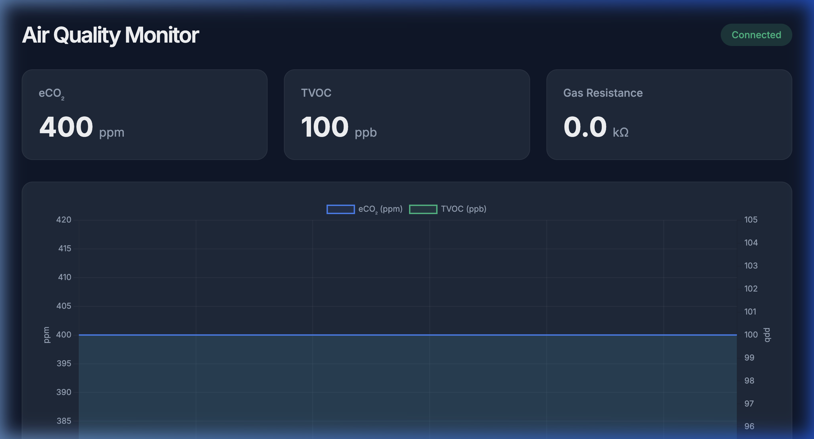
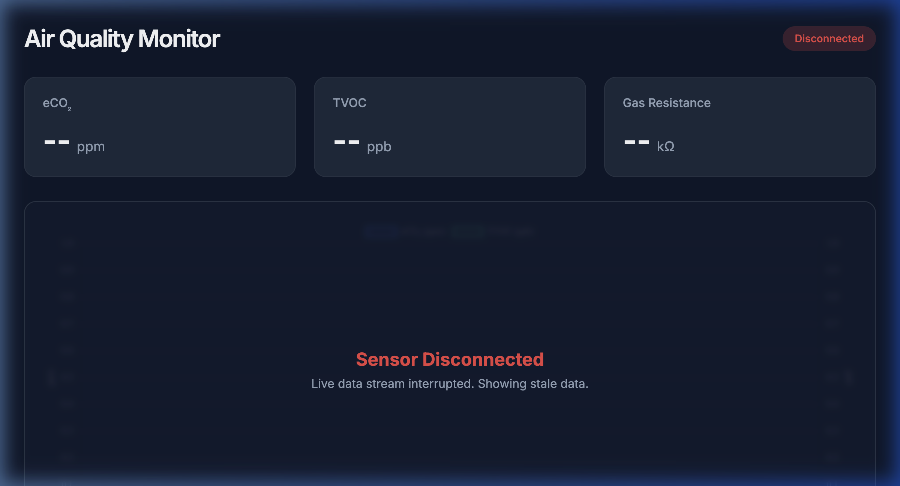

# Linux AQI Driver Project

A real-time Linux Air Quality (AQI) monitoring stack featuring a kernel driver (CCS811), Python WebSocket gateway, and a modern web dashboard.

## 🚀 Quick Start

### 1. VM Environment (Ubuntu 24.04)
Run the setup script to provision the Lima VM with necessary kernel headers and I2C tools:
```bash
./scripts/setup-lima-vm.sh
```

### 2. Build & Load
Compile and load the kernel module inside the VM:
```bash
limactl shell aqi-dev -- make -C kernel
limactl shell aqi-dev -- sudo insmod kernel/aqi_sensor.ko
```

### 3. Run Simulation
Launch the real-time simulation and backend:
```bash
# Start backend gateway (Host)
uv run backend/src/sensor_stream.py

# Open Dashboard
open frontend/index.html
```

## 🔍 Walkthrough

### 1. Hardware Simulation
We use `i2c-stub` inside the Lima VM to simulate a **CCS811 sensor**, enabling safe, host-independent driver verification.

### 2. Kernel Driver Layer
The `aqi_sensor` module binds to the virtual I2C bus, exposing a character device at `/dev/aqi_sensor`. It handles SMbus reads and provides an IOCTL interface for hardware control.

### 3. Userspace Aggregation
The `aqi_reader` (C) fetches data from the kernel and outputs structured JSON. The Python backend then bridges this telemetry to the Host using `limactl shell`.

### 4. Real-time Visualization
Data is streamed via WebSockets to a modern frontend dashboard with live graphing and threshold alerting.

### Monitoring Dashboard

*Real-time sensor data visualized on the dashboard.*


*Dashboard showing disconnected status when the backend is offline.*

## 🛠 Features
- [x] Character Device Interface with IOCTL support.
- [x] Automated VM isolation for safe kernel development.
- [x] High-frequency real-time dashboard updates.
- [x] PEP 723 inline dependency management via `uv`.
